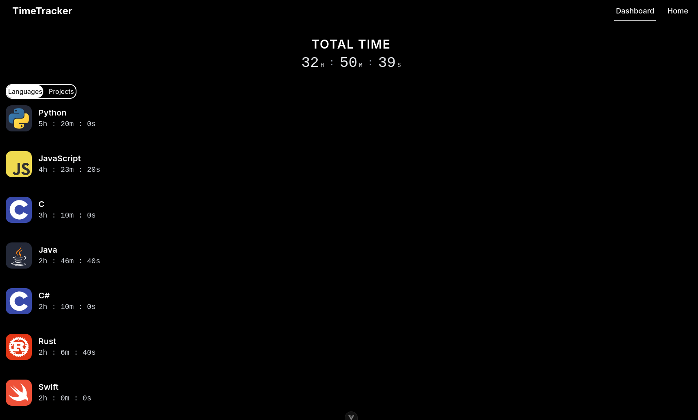
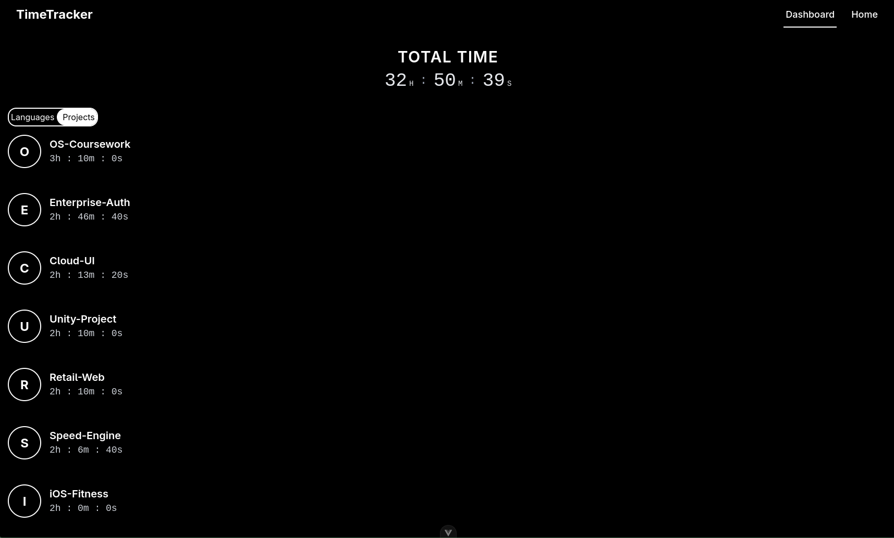

# VS Code Time Tracker
<table>
  <tr>
    <td></td>
    <td></td>
  </tr>
</table>
An activity tracker that monitors file usage in Visual Studio Code and visualizes it via a web interface.

## Prerequisites

Before getting started, ensure you have the following installed:

* **Node.js & npm** – to run the frontend dashboard.
* **Visual Studio Code** – the primary editor environment.

---

##  Setup Instructions

### 1. Install the VS Code Extension

Currently, the extension is installed manually via VSIX:

1. Open **Visual Studio Code**.
2. Navigate to the **Extensions** view (`Ctrl+Shift+X`).
3. Click the **More Actions** (...) icon in the top-right corner.
4. Select **Install from VSIX...**.
5. Select `extension/timetracker-0.0.1.vsix` from the project directory.

---

## How to Use

* **Automatic Tracking:** Once the extension is active, it automatically logs the time spent on every file you open.
* **View Statistics:** Open your browser and navigate to:
> **[http://localhost:5173](http://localhost:5173)
